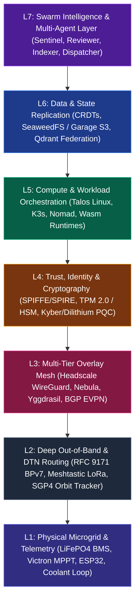
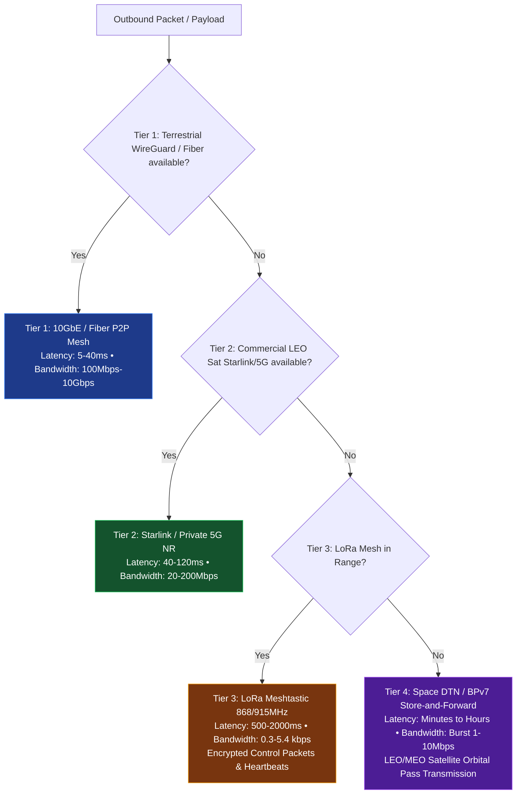
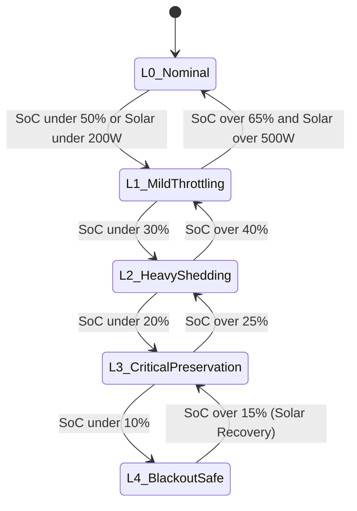
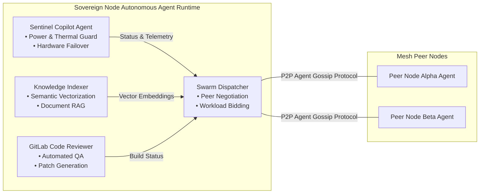
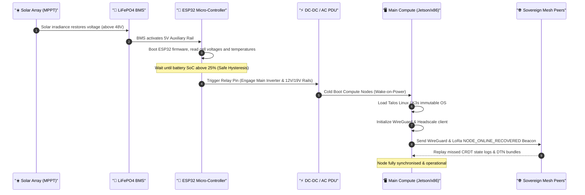

# 🌐 Architecture for a Fully Autonomous Network of Sovereign Mini Datacenters

> **Sovereign Mesh & Autonomous Micro-Datacenter Network Architecture**  
> Complete design specification for decentralized, off-grid, energy-aware, self-healing compute clusters.  
> Developed by **[Metatopia Studio](https://metatopia.gr)** · License: MIT · © 2026

---

## 1. Executive Summary & Vision

A **Fully Autonomous Network of Sovereign Mini Datacenters (Autonomous Sovereign Mesh)** is a zero-trust, decentralized, self-governing compute fabric designed to operate seamlessly across catastrophic infrastructure failures, long-term power grid blackouts, geopolitical isolation, and extreme network partitions.

Unlike traditional cloud architectures that depend on centralized control planes (e.g. AWS, Azure, GCP, Cloudflare), **every node in this network is an independently viable sovereign micro-datacenter**. Each unit incorporates its own:
- ☀️ **Solar Micro-Grid & Battery Management System (BMS)**
- ❄️ **Closed-Loop Liquid Cooling Subsystem**
- 🤖 **Local AI Inference Engine & Multi-Agent Copilots**
- 📡 **Multi-Spectral Communication Transceivers** (Terrestrial Mesh, Starlink/LEO, Sub-GHz LoRa, and Space DTN/BPv7)

```
                                    ┌──────────────────────────────────────┐
                                    │    LEO/MEO SATELLITE CONSTELLATION   │
                                    │    (Orbital DTN / BPv7 Store-Forward)│
                                    └──────┬──────────────────────┬────────┘
                                           │ RFC 9171 Bundles     │ SGP4 Pass Tracking
                                           ▼                      ▼
┌──────────────────────────────────────────────┐              ┌──────────────────────────────────────────────┐
│       NODE-ALPHA (Sovereign Core)            │              │        NODE-BETA (Edge AI Station)           │
│ ┌──────────────────────────────────────────┐ │              │ ┌──────────────────────────────────────────┐ │
│ │ Power Microgrid: 1.64kW PV + 10.24kWh    │ │              │ │ Power Microgrid: 820W PV + 5.12kWh       │ │
│ │ Compute: 2x DGX / Jetson (550 TOPS INT8) │ │              │ │ Compute: 1x Jetson Orin AGX (275 TOPS)   │ │
│ │ Storage: 8TB NVMe RAID-1 (ZFS + Seaweed) │ │              │ │ Storage: 4TB NVMe RAID-1                 │ │
│ │ Local AI: Ollama + Qdrant RAG + Sentinel │ │              │ │ Local AI: Ollama + Local Agents          │ │
│ └──────────────────────────────────────────┘ │              │ └──────────────────────────────────────────┘ │
│  Transceivers: 10GbE SFP+ | LoRa | Starlink  │              │  Transceivers: 2.5GbE | LoRa | Direct LEO    │
└──────┬────────────────────────────────┬──────┘              └──────┬────────────────────────────────┬──────┘
       │                                │                            │                                │
       │ WireGuard / Nebula P2P Overlay │                            │ WireGuard / Nebula P2P Overlay │
       │ (100.64.0.0/16 High-Bandwidth) │                            │ (100.64.0.0/16 High-Bandwidth) │
       ├────────────────────────────────┼────────────────────────────┤                                │
       │                                │                                                             │
       │                                │ LoRa 868/915MHz Out-of-Band Emergency Control Plane         │
       │                                └─────────────────────────────────────────────────────────────┘
       ▼
┌──────────────────────────────────────────────┐
│       NODE-GAMMA (Island Off-Grid)           │
│ ┌──────────────────────────────────────────┐ │
│ │ Power Microgrid: 3.28kW PV + 20.48kWh    │ │
│ │ Compute: 4x Jetson Orin Nodes (1100 TOPS)│ │
│ │ Storage: 16TB Encrypted Ceph/Garage S3   │ │
│ │ Autonomous Agents: Master Dispatcher     │ │
│ └──────────────────────────────────────────┘ │
│  Transceivers: LoRa Gateway | Iridium SBD   │
└──────────────────────────────────────────────┘
```

---

## 2. Layered Autonomous Stack (7-Layer Protocol Model)



| Layer | Subsystem | Sovereign Technology Stack | Primary Function |
| :--- | :--- | :--- | :--- |
| **L7: Swarm Intelligence** | Multi-Agent Coordination | Autonomous Sentinel, GitLab Reviewer, Indexer, Auto-Disaster Broker | Workload negotiation, energy-aware job dispatch, model weight sharing. |
| **L6: Data & Consensus** | Distributed State Fabric | CRDTs, SeaweedFS / Garage S3, Qdrant Federation, Raft State Quorum | Masterless data sync, vector index federation, zero-loss snapshotting. |
| **L5: Compute & Workloads** | Sovereign Orchestration | Talos Linux + K3s / Nomad / Docker Engine, WebAssembly (Wasm) | Dynamic container scheduling, AI batch pipelines, emergency load shedding. |
| **L4: Trust & Identity** | Zero-Trust & PKI | SPIFFE/SPIRE, TPM 2.0 / HSM Attestation, Kyber/Dilithium PQC | Cryptographic machine identity, mutual TLS (mTLS), hardware trust roots. |
| **L3: Network Fabric** | Multi-Tier Overlay Mesh | Headscale (WireGuard), Nebula, Yggdrasil, BGP EVPN | Seamless P2P flat mesh routing across dynamic NATs, firewalls, and air-gaps. |
| **L2: Deep Out-of-Band** | Emergency Comms & DTN | RFC 9171 DTN/BPv7, Meshtastic LoRa, Starlink, SGP4 Orbit Tracker | Asynchronous orbital store-and-forward, low-baud heartbeat broadcast. |
| **L1: Energy & Physical** | Microgrid & Telemetry | LiFePO4 BMS, Victron MPPT (VE.Direct/RS485), ESP32, Liquid Cooling | Solar harvesting, autonomous thermal regulation, brownout cold-recovery. |

---

## 3. Multi-Tier Communication Fabric

When operating a distributed network of sovereign nodes, network connectivity is treated as dynamic and probabilistic. The network implements **four autonomous communication tiers** with automatic, seamless failover and failback:



### Communication Tier Details

1. **Tier 1: High-Bandwidth Terrestrial Zero-Trust Mesh (Headscale / Nebula)**
   * **Underlay**: Fiber broadband, point-to-point 60GHz / 5GHz wireless bridges, local LANs.
   * **Overlay**: WireGuard encrypted peer-to-peer tunnels managed by a federated control plane.
   * **Payloads**: Real-time multi-node AI model updates, Git repository synchronization, streaming telemetry, live database transactions.

2. **Tier 2: Starlink / Direct-to-Cell / Private 5G NR**
   * **Trigger**: Automated failover upon loss of terrestrial pings (>3 lost heartbeats).
   * **Action**: Multi-WAN router auto-routes encrypted mesh overlay traffic over satellite/cellular interfaces.

3. **Tier 3: LoRa Meshtastic Out-of-Band Emergency Control Plane (Sub-GHz)**
   * **Physical**: Semtech SX1262 LoRa transceiver driven by the ESP32 bridge.
   * **Protocol**: Meshtastic packet format with hardware-accelerated AES-256-GCM encryption.
   * **Capacity**: Node heartbeat telemetry (SoC, load, critical alerts), cryptographic kill/wake signals, emergency cluster state broadcast.

4. **Tier 4: Space DTN / BPv7 Store-and-Forward (RFC 9171)**
   * **Trigger**: Complete terrestrial and line-of-sight isolation (Grid Down / Electromagnetic disruption).
   * **Mechanism**: The node's `smdc.space` orbital propagator tracks LEO/MEO satellite relays using real-time SGP4 orbit propagation. Encrypted bundles are queued in persistent NVMe storage and burst-transmitted during Acquisition of Signal (AOS) to Loss of Signal (LOS) windows.

---

## 4. Energy-Directed Distributed Workload Scheduling (Green-Compute Routing)

Workload execution across the sovereign network is continuously steered by **real-time solar irradiance and battery State-of-Charge (SoC)**. Workloads dynamically gravitate toward nodes with energy surplus.

### Compute Routing Equation

$$
S_i = \omega_1 \cdot \mathrm{SoC}_i + \omega_2 \cdot \frac{P_{\mathrm{solar}, i}}{P_{\mathrm{max}}} + \omega_3 \cdot (1 - U_{\mathrm{gpu}, i}) - \omega_4 \cdot \hat{T}_{\mathrm{coolant}, i}
$$

Where:
- $\mathrm{SoC}_i \in [0, 1]$ is the battery State of Charge.
- $P_{\mathrm{solar}, i} / P_{\mathrm{max}}$ is the normalized solar power harvesting rate.
- $U_{\mathrm{gpu}, i} \in [0, 1]$ is the active compute utilization.
- $\hat{T}_{\mathrm{coolant}, i} \in [0, 1]$ is the coolant loop temperature normalized against maximum safe operating temperature.
- $\omega_1, \omega_2, \omega_3, \omega_4$ are dynamically weighted scheduling coefficients.

```
                ┌────────────────────────────────────────────────────────┐
                │          DISTRIBUTED ENERGY AWARENESS MATRIX           │
                └───────────────────────────┬────────────────────────────┘
                                            │
               ┌────────────────────────────┴────────────────────────────┐
               ▼                                                         ▼
    ┌──────────────────────┐                                  ┌──────────────────────┐
    │     NODE ALPHA       │                                  │      NODE BETA       │
    │ ☀️ Solar: 1,450 W    │                                  │ ☁️ Solar: 80 W       │
    │ 🔋 SoC: 96% (Surplus)│                                  │ 🔋 SoC: 28% (Warning)│
    │ 🌡️ Coolant: 27°C     │                                  │ 🌡️ Coolant: 34°C     │
    └──────────┬───────────┘                                  └──────────┬───────────┘
               │                                                         │
               │ ◄────────── MIGRATES AI INFERENCE & RAG JOBS ───────────┤
               │             (Via Autonomous Swarm Dispatcher)           │
               ▼                                                         ▼
    ┌──────────────────────┐                                  ┌──────────────────────┐
    │ High-Power AI Batch  │                                  │ Low-Power Standby    │
    │ Vector Re-indexing   │                                  │ LoRa Heartbeat Only  │
    │ Model Fine-Tuning    │                                  │ Load Shedding L3     │
    └──────────────────────┘                                  └──────────────────────┘
```

### Autonomous Dynamic Load-Shedding Levels



* **Level 0 (Nominal, SoC > 50%)**: Full power. Dual DGX/Jetson accelerators active, full RAG indexing, continuous Git CI/CD builds, open peer-relay bandwidth.
* **Level 1 (Mild Throttling, SoC 30–50%)**: GPU power capped to 50W (Dynamic FP16/INT8 quantizations), background CI jobs paused, non-critical telemetry scraped at 60s intervals instead of 5s.
* **Level 2 (Heavy Shedding, SoC 20–30%)**: Secondary compute nodes powered down via Smart PDU / Relay. Only master control plane active. Local AI restricted to high-priority queries only.
* **Level 3 (Critical Preservation, SoC 10–20%)**: Primary compute put into deep sleep (`suspend-to-RAM`). ESP32 telemetry bridge and MikroTik switch remain on low-power 12V DC rail. LoRa emergency beacons transmitted every 10 minutes.
* **Level 4 (Blackout Safe State, SoC < 10%)**: All AC inverters isolated. Total shutdown of compute to prevent LiFePO4 cell undervoltage. ESP32 enters deep-sleep listening for Solar Wakeup Interrupt (>48V MPPT solar input).

---

## 5. Decentralized Storage, Sync & State Replication

Data in an autonomous network survives complete network isolation without split-brain corruption.

```
                              ┌───────────────────────────────────┐
                              │     SOVEREIGN STATE HIERARCHY     │
                              └─────────────────┬─────────────────┘
                                                │
         ┌──────────────────────────────┬───────┴──────────────────────┬──────────────────────────────┐
         ▼                              ▼                              ▼                              ▼
┌──────────────────┐          ┌──────────────────┐          ┌──────────────────┐          ┌──────────────────┐
│  GIT EMBEDDED    │          │  OBJECT STORAGE  │          │  VECTOR DATABASE │          │  KEY-VALUE DB    │
│  REPOSITORIES    │          │  (SeaweedFS/S3)  │          │  (Qdrant Engine) │          │  (CRDT Engine)   │
├──────────────────┤          ├──────────────────┤          ├──────────────────┤          ├──────────────────┤
│ Multi-Master P2P │          │ Geo-Replication  │          │ Local Embeddings │          │ Conflict-Free    │
│ Git Bundle Sync  │          │ Content Address  │          │ Vector Shards    │          │ Replicated Types │
│ via WireGuard &  │          │ Erasure Coded    │          │ Peer Nearest-    │          │ Node Configs &   │
│ DTN Satellite    │          │ Deduplicated     │          │ Neighbor Search  │          │ Node Registries  │
└──────────────────┘          └──────────────────┘          └──────────────────┘          └──────────────────┘
```

1. **Object Storage Layer (SeaweedFS / Garage S3)**
   * Masterless distributed S3-compatible cluster with Reed-Solomon Erasure Coding ($N=4, K=2$).
   * Local writes persist to local NVMe immediately; asynchronous synchronization triggers upon mesh link re-establishment.

2. **Semantic Memory & Vector Search (Federated Qdrant)**
   * Local embeddings generated via quantized on-node models (`nomic-embed-text` / `bge-m3`).
   * Collections partitioned by Node IDs with distributed HNSW graph querying across active mesh links.

3. **Encrypted Snapshot Quorum (Restic Engine)**
   * Scheduled zero-knowledge encrypted restic backups replicated across $M \ge 3$ sovereign peers.
   * Cryptographically sealed with hardware-backed TPM/HSM master keys.

---

## 6. Multi-Agent Swarm Intelligence & Governance

Each sovereign datacenter runs a localized multi-agent loop collaborating with peer agents across the mesh:



- **Sentinel Copilot Agent**: Parses hardware telemetry (`/dev/ttyUSB0` VE.Direct, RS485 Modbus, 1-Wire sensors) and executes deterministic emergency actions (GPU throttling, coolant pump speed adjustment, radiator fan PWM control).
- **Swarm Dispatcher Agent**: Participates in an open compute-bidding marketplace, shifting heavy compute tasks to nodes with >80% battery SoC and excess solar.
- **Space Link Scheduler Agent**: Continuously recalculates orbital trajectories for LEO satellites using SGP4 algorithms, queueing DTN bundles for burst transmission during orbital passes.

---

## 7. Zero-Trust Security, Identity & Cryptographic Roots

Security in an autonomous network operates without dependence on external Certificate Authorities or single points of failure.

```
                    ┌────────────────────────────────────────────────────────┐
                    │               HARDWARE ROOT OF TRUST                   │
                    │               (TPM 2.0 / YubiKey HSM)                  │
                    └───────────────────────────┬────────────────────────────┘
                                                │
                     ┌──────────────────────────┴──────────────────────────┐
                     ▼                                                     ▼
    ┌──────────────────────────────────┐                  ┌──────────────────────────────────┐
    │     DECENTRALIZED ID (DID)       │                  │     SPIFFE / SPIRE WORKLOAD      │
    │   did:sovereign:node-alpha-01    │                  │           ATTESTATION            │
    └──────────────────┬───────────────┘                  └──────────────────┬───────────────┘
                       │                                                     │
                       ▼                                                     ▼
    ┌──────────────────────────────────┐                  ┌──────────────────────────────────┐
    │ Post-Quantum Cryptography (PQC)  │                  │ Mutual TLS (mTLS) Inter-Service  │
    │ Kyber-1024 Key Encapsulation     │                  │ Short-lived x509 SVIDs           │
    │ Dilithium-5 Signatures           │                  │ Hardware Attested Identity       │
    └──────────────────────────────────┘                  └──────────────────────────────────┘
```

1. **Hardware-Attested Node Identity**: Immutable cryptographic identity rooted in discrete TPM 2.0 chips. Boot integrity verified via UEFI Secure Boot and Talos Linux immutable kernel validation.
2. **Workload Attestation (SPIFFE/SPIRE)**: Services receive dynamic, short-lived X.509 SVID certificates based on runtime cryptographic attestation of container hashes, namespaces, and node signatures.
3. **Mesh Threat Defense (CrowdSec Mesh)**: Attack signatures detected on one node are gossiped across the mesh via WireGuard and LoRa, immunizing the entire network in real-time.
4. **Post-Quantum Cryptography (PQC)**: Inter-node tunnels employ hybrid post-quantum key encapsulation (X25519 + Kyber-1024) to secure data against future quantum decryption.

---

## 8. Disaster Recovery, Black-Start & Self-Healing Protocol

When a node experiences a catastrophic blackout or hardware fault, it recovers autonomously through a deterministic **Cold-Start Sequence**:



---

## 9. Comprehensive Node Hardware & Topology Reference

| Node Archetype | Hardware Platform | Power Subsystem | Primary Capabilities | Typical Location |
| :--- | :--- | :--- | :--- | :--- |
| **Core Nexus** | 2x NVIDIA DGX / Dual AMD EPYC + 4x RTX 4090 | 10.24–20.48 kWh LiFePO4 + 2.4 kW Solar | Heavy LLM fine-tuning, Master Headscale control plane, S3 Master. | Fixed bunker, research lab, regional HQ |
| **Edge Station** | 1x NVIDIA Jetson AGX Orin + 1x Supermicro Mini-ITX | 5.12 kWh LiFePO4 + 820W Solar | Local AI inference, GitLab CI/CD, Nextcloud file sync, Starlink uplink. | Remote outpost, mobile vehicle, container |
| **Off-Grid Island** | 2x Low-power ARM64 nodes + SX1262 LoRa + Iridium | 2.56 kWh LiFePO4 + 410W Solar | Mesh relay, LoRa packet gateway, environmental sensing, DTN pass station. | Mountain peak, island, deep wilderness |

---

## 10. Implementation Roadmap

```
Phase 1: Multi-Node Overlay & Zero-Trust PKI
  ├── Extend `software/vpn/` with automated Headscale federated join
  ├── Integrate SPIRE/SPIFFE workload attestation into `kubernetes/helm/`
  └── Implement DID node registration in `src/sovereign_dc/mesh/`

Phase 2: Energy-Aware Workload Dispatcher
  ├── Integrate Victron/BMS telemetry into Kubernetes custom metrics API (KEDA)
  ├── Build `smdc mesh schedule` algorithm for solar-following job migration
  └── Add LoRa emergency shed/wake signal handlers to `firmware/`

Phase 3: Decentralized Storage & CRDT State Sync
  ├── Deploy SeaweedFS / Garage S3 multi-cluster geo-replication
  ├── Implement distributed vector search aggregation in `smdc agent`
  └── Add async Git bundle exchange over DTN (`smdc space sync`)

Phase 4: Autonomous Swarm Multi-Agent Governance
  ├── Create P2P gossip broker for Sentinel agents
  ├── Connect CrowdSec mesh threat intelligence across all nodes
  └── Launch automated orbital DTN contact scheduling with automated ground station tracking
```
