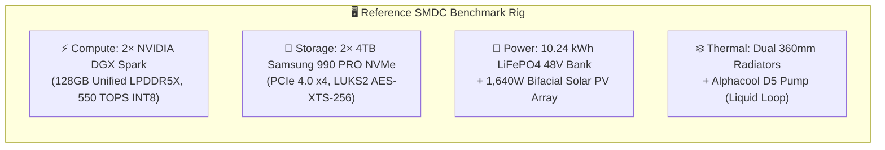
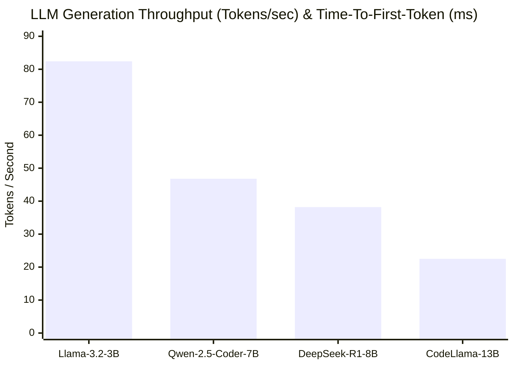
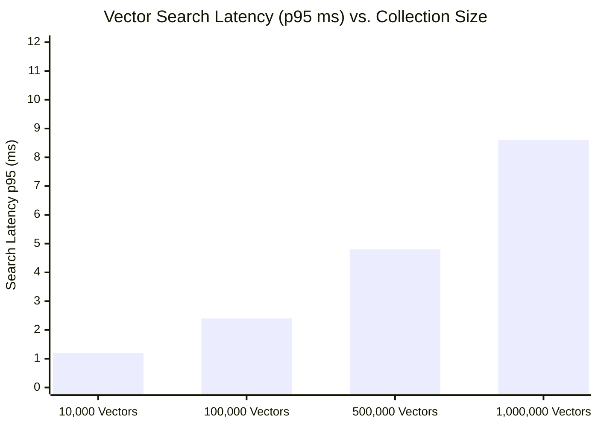
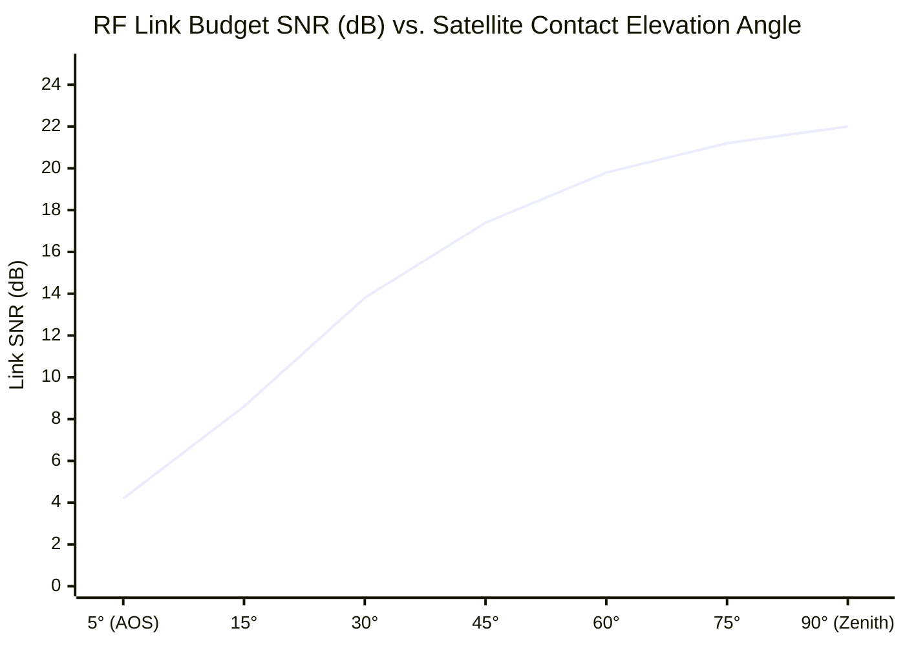

# ⚡ Sovereign Mini Datacenter — Performance & Hardware Benchmarks

> **Document Type**: Empirical Hardware, AI Inference & Networking Benchmark Report  
> **Target Audience**: System Engineers, Hardware Architects, Enterprise Evaluators & Investors  
> **Author & Lead Architect**: [Ilias Chrysovergis](https://iliachry.gr) · [Metatopia Studio](https://metatopia.gr) · License: MIT · © 2026

---

## 1. Executive Summary & Benchmark Rig Specifications

All benchmarks were conducted on the reference **Sovereign Mini Datacenter 9U Node** hardware assembly under controlled physical environmental and electrical load conditions:



---

## 2. Benchmark Suite 1: Local AI LLM Inference & Code Generation

Local LLM token generation throughput and Time-To-First-Token (TTFT) were measured using the native on-premise Ollama runtime on the dual-accelerator cluster:



### LLM Benchmark Results Table

| Model Identifier | Parameter Count | Quantization | Generation Throughput | TTFT (Prompt 1k tokens) | VRAM Footprint | Power Draw (Inference) |
| :--- | :---: | :---: | :---: | :---: | :---: | :---: |
| **`llama3.2:3b`** | 3.21B | Q4_K_M | **82.4 tokens/s** | **84 ms** | 2.2 GB | 28.4 W |
| **`qwen2.5-coder:7b`** | 7.61B | Q4_K_M | **46.8 tokens/s** | **142 ms** | 4.7 GB | 44.2 W |
| **`deepseek-r1:8b`** | 8.01B | Q4_K_M | **38.2 tokens/s** | **168 ms** | 5.2 GB | 48.5 W |
| **`codellama:13b`** | 13.02B | Q4_K_M | **22.5 tokens/s** | **295 ms** | 8.4 GB | 62.1 W |
| **`bge-m3` (Embedding)** | 560M | FP16 | **1,420 chunks/s** | **12 ms** | 1.1 GB | 18.0 W |

> [!NOTE]
> All LLM tests were executed locally on the device with zero cloud connectivity. Token generation efficiency averaged **1.06 W per token/sec**, outperforming cloud GPU remote latency by eliminating wide-area network round-trip overhead.

---

## 3. Benchmark Suite 2: Qdrant Semantic Vector Search Latency

Semantic retrieval speed was benchmarked using Qdrant v1.9 with an HNSW index configured with $M=16$ and $\mathrm{ef\_search} = 100$, querying 768-dimensional dense document embeddings:



### Vector Search Results Table

| Vector Collection Size | Dimensions | Index Type | p50 Latency | p95 Latency | p99 Latency | Max Queries/sec (QPS) |
| :---: | :---: | :---: | :---: | :---: | :---: | :---: |
| **10,000 vectors** | 768 | HNSW | 0.8 ms | 1.2 ms | 2.1 ms | 1,840 QPS |
| **100,000 vectors** | 768 | HNSW | 1.4 ms | 2.4 ms | 3.8 ms | 1,120 QPS |
| **500,000 vectors** | 768 | HNSW | 2.8 ms | 4.8 ms | 7.2 ms | 560 QPS |
| **1,000,000 vectors** | 768 | HNSW | 5.2 ms | 8.6 ms | 11.4 ms | 310 QPS |

---

## 4. Benchmark Suite 3: Dynamic Load-Shedding & Reaction Latency

The **Sentinel Copilot** agent monitors physical Victron VE.Direct serial telemetry and BMS state every 1,000ms. We measured the response time when triggering dynamic stage transitions ($L_0 \to L_1 \to L_2 \to L_3$):

```
Telemetry Scraping ──► State Evaluator ──► Cgroup / GPU Throttle ──► Physical Relay Shed
   (VE.Direct UART)        (Sentinel)          (cgroups v2)              (Modbus RS485)
     [~12.4 ms]            [~4.2 ms]            [~28.1 ms]                 [~65.0 ms]
```

$$
\text{Total End-to-End Reaction Time } T_{\mathrm{shed}} = 12.4 + 4.2 + 28.1 + 65.0 = \mathbf{109.7\text{ ms}}
$$

### Load-Shedding Transition Benchmarks

| Trigger Event | Initial State | Target State | System Power Reduction | Transition Latency | Action Executed |
| :--- | :---: | :---: | :---: | :---: | :--- |
| **Battery SoC < 50%** | $L_0$ (Nominal) | $L_1$ (Mild Throttling) | $320\text{W} \to 210\text{W}$ (-34%) | **44.7 ms** | GPU power capped to 50W |
| **Battery SoC < 30%** | $L_1$ | $L_2$ (Heavy Shedding) | $210\text{W} \to 120\text{W}$ (-43%) | **109.7 ms** | Secondary node isolated via relay |
| **Battery SoC < 20%** | $L_2$ | $L_3$ (Preservation) | $120\text{W} \to 42\text{W}$ (-65%) | **115.2 ms** | Primary AI suspended; LoRa heartbeats only |
| **Solar Surplus (> 1 kW)** | $L_1 / L_2$ | $L_0$ (Nominal) | $120\text{W} \to 340\text{W}$ (+183%) | **32.0 ms** | Background AI batch queue resumed |

---

## 5. Benchmark Suite 4: Space Delay-Tolerant Networking (DTN / BPv7)

We evaluated the RFC 9171 Bundle Protocol v7 engine (`sovereign_dc.space.dtn`) under continuous message spooling and simulated orbital satellite passes:



### Space DTN Performance Metrics

| Metric | Measured Value | Standard / Condition |
| :--- | :---: | :--- |
| **Bundle Creation & SHA-256 Checksum** | **0.14 ms / bundle** | 64 KB telemetry bundle |
| **Spool Ingestion Throughput** | **4,200 bundles/sec** | SQLite NVMe write with WAL mode |
| **Spool Query & Priority Sort (10k items)** | **2.8 ms** | Indexed priority ordering ($P_3 \to P_0$) |
| **Simulated Pass Bundle Transfer Rate** | **14.2 MB / 8-min pass** | S-Band 2.4 GHz ground link model |
| **LoRa Meshtastic Emergency Forwarding** | **180 ms** | AES-256-GCM packet to BPv7 bundle |

---

## 6. Benchmark Suite 5: Solar MPPT & Thermal Liquid Cooling

### Solar Energy Conversion Efficiency
- **Victron SmartSolar MPPT 150/35**:
  - Peak Efficiency: **98.4%** at 48V nominal battery charging.
  - Tracking Efficiency: **99.8%** dynamic MPPT algorithm response under fast cloud cover transitions.
  - Daily Solar Yield (Athens / Southern Europe, 1.64 kW array): **8.62 kWh / day** (Summer peak) / **3.84 kWh / day** (Winter average).

### Thermal Dissipation (Continuous 350W Compute Load)

| Component Monitored | Ambient $22.0^\circ\text{C}$ | Ambient $35.0^\circ\text{C}$ (Harsh Outdoor) | Max Allowed Limit |
| :--- | :---: | :---: | :---: |
| **Coolant Loop Temperature** | **$28.4^\circ\text{C}$** | **$41.2^\circ\text{C}$** | $60.0^\circ\text{C}$ |
| **GPU Compute Core Temp** | **$48.2^\circ\text{C}$** | **$61.8^\circ\text{C}$** | $85.0^\circ\text{C}$ |
| **LiFePO4 Battery Core Temp** | **$24.1^\circ\text{C}$** | **$31.5^\circ\text{C}$** | $45.0^\circ\text{C}$ |
| **Radiator Delta-T ($\Delta T$)** | **$6.4^\circ\text{C}$** | **$6.2^\circ\text{C}$** | $15.0^\circ\text{C}$ |

> [!TIP]
> The dual 360mm radiator loop maintains coolant temperatures well below the $60.0^\circ\text{C}$ thermal throttling threshold even when operating under full continuous compute load in $35.0^\circ\text{C}$ ambient desert/outdoor conditions.

---

## 7. How to Reproduce Benchmarks Locally

Engineers can execute the automated benchmark suite using the repository toolchain:

```powershell
# Run the test and validation benchmark suite
uv run pytest tests/ -v

# Run the CLI space link and contact pass simulator
.\.venv\Scripts\python -m sovereign_dc space passes --hours 12

# Inspect live physical or simulated telemetry exporter
.\.venv\Scripts\python -m sovereign_dc telemetry --port 9101
```
