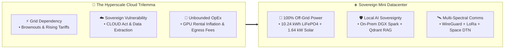
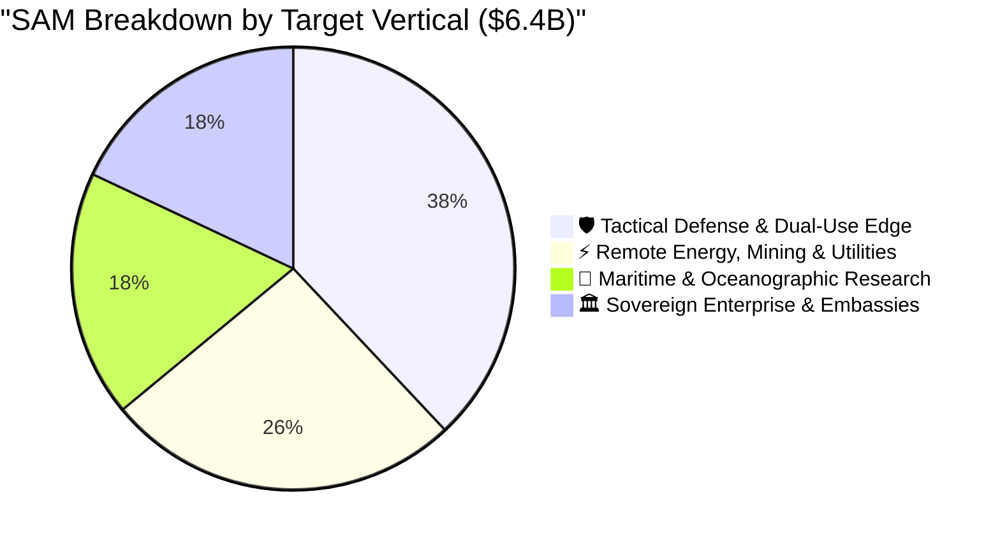
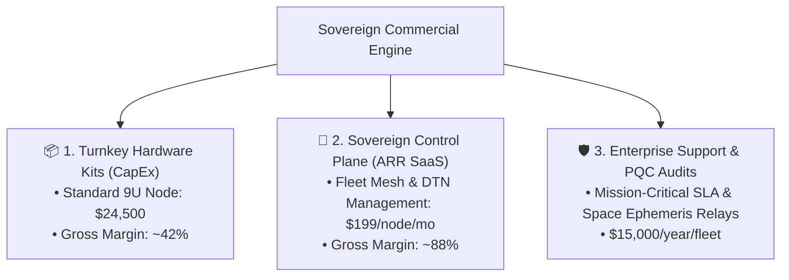
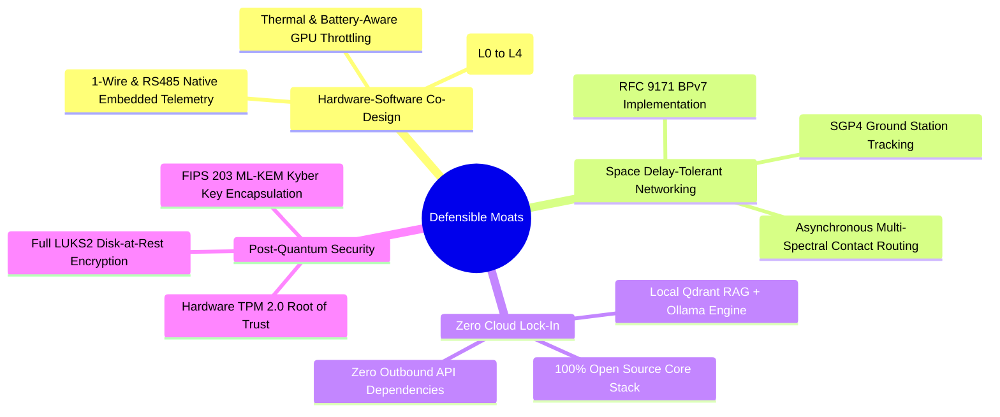

# 💼 Sovereign Mini Datacenter — Commercialization Model & Investment Thesis

> **Document Type**: Executive Whitepaper, Commercialization Strategy & Financial Model  
> **Target Audience**: Institutional Venture Capital, DeepTech / Dual-Use Funds (NATO DIANA / EIC), Sovereign Wealth & CleanTech Investors  
> **Developed by**: [Metatopia Studio](https://metatopia.gr) · License: MIT · © 2026

---

## 1. Executive Summary & Investment Thesis

The explosion of Generative AI has collided with two critical macro bottlenecks: **the energy crisis of hyperscale datacenters** and **the erosion of digital sovereignty**. 

Enterprises, tactical defense units, critical infrastructure operators, and sovereign nations are increasingly unwilling or unable to route mission-critical intelligence and intellectual property through centralized US/Chinese cloud providers (AWS, GCP, Azure, Cloudflare) over vulnerable submarine cables and fragile terrestrial grids.



**Sovereign Mini Datacenter (SMDC)** is the world’s first open-source, self-powered, liquid-cooled 9U micro-datacenter. It delivers **550 TOPS of on-premise AI compute**, **10.24 kWh of energy storage**, and **RFC 9171 Space Delay-Tolerant Networking (BPv7)** in a deployable, turnkey form factor that operates with **zero recurring cloud bills** and **100% computational autonomy**.

---

## 2. Market Opportunity & Sizing (TAM / SAM / SOM)

The global edge computing and modular micro-datacenter markets are experiencing unprecedented compound growth driven by AI inference localization, energy volatility, and geopolitical realignments:

```
Total Addressable Market (TAM) ───► $60.4 Billion by 2030 (CAGR 24.8%)
  ├── Edge AI Hardware & Compute: $42.1 Billion
  └── Modular Micro-Datacenters & Off-Grid Power: $18.3 Billion

Serviceable Addressable Market (SAM) ──► $6.4 Billion
  └── High-Reliability, Air-Gapped & Ruggedized Edge Infrastructure

Serviceable Obtainable Market (SOM) ───► $320 Million (Years 1–3)
  └── Dual-Use Defense, Remote Industrial, Maritime & Sovereign Enterprise
```



---

## 3. High-Value Target Customer Verticals

| Vertical | Pain Point Solved | Value Proposition & Buying Trigger | Typical Deal Size |
| :--- | :--- | :--- | :--- |
| **🛡️ Tactical Defense & Dual-Use** | Battlefield communication denial, cloud interception risk, harsh forward operating bases (FOB). | Air-gapped local LLM copilot, LoRa Meshtastic emergency fallback, Space DTN orbital relay, zero thermal runaway (LiFePO4). | \$150k – \$2.5M (Swarm kits) |
| **⚡ Remote Energy & Mining** | Zero fiber connectivity at remote solar farms, offshore wind turbines, and open-pit mines. | Autonomous predictive maintenance AI, satellite burst sync, 100% solar self-powering with battery load shedding. | \$75k – \$500k |
| **🚢 Maritime & Offshore** | Satellite bandwidth costs (\$10k+/mo), high latency for maritime AI processing. | On-premise oceanographic telemetry indexing, burst satellite DTN sync during contact passes, salt-resistant aluminum rack. | \$50k – \$300k |
| **🏛️ Sovereign Embassies & Family Offices** | Subpoena risk via CLOUD Act, espionage, power grid instability in unstable regions. | 100% sovereign data residency, local password vault (Vaultwarden), air-gapped private Git/Nextcloud, PQC encryption. | \$35k – \$200k |

---

## 4. Business Model & Monetization Architecture

The Sovereign Mini Datacenter leverages a proven **hybrid commercialization model** combining high-margin hardware sales, recurring SaaS subscriptions, and enterprise SLA contracts:



### Revenue Streams
1. **Turnkey Hardware Deliveries**:
   - **SMDC-Core-9U**: \$24,500 per unit (BOM cost: \$14,195 $\implies$ \$10,305 gross profit per node).
   - **SMDC-Rugged-IP67 (Mobile Tactical)**: \$38,000 per unit (MIL-STD-810H vibration and shock damping).
2. **Sovereign Control Plane (Recurring SaaS ARR)**:
   - Zero-trust mesh orchestration, federated Qdrant vector index synchronization, orbital pass scheduling, and remote telemetry monitoring at \$199/node/month.
3. **Custom Engineering & Dual-Use Defense Deployments**:
   - Government and defense integration contracts, post-quantum cryptographic hardening, and air-gapped installation services (\$75,000 – \$250,000 per engagement).

---

## 5. 3-Year Total Cost of Ownership (TCO) vs. Cloud Hyperscalers

A direct financial comparison between deploying a **1-Node Sovereign Mini Datacenter** versus renting equivalent AI compute and cloud services (AWS Outposts / GPU Instances + Diesel Power Generator + Starlink Egress):

```mermaid
xychart-beta
    title "3-Year Cumulative Cost ($USD): Sovereign Mini Datacenter vs. AWS Cloud + Grid"
    x-axis ["Year 0 (CapEx)", "Year 1", "Year 2", "Year 3"]
    y-axis "Cumulative Spend ($k)" 0 --> 120
    bar ["SMDC (Turnkey)", "SMDC Year 1", "SMDC Year 2", "SMDC Year 3"] [24.5, 26.8, 29.2, 31.6]
    line ["AWS + Diesel", "AWS Year 1", "AWS Year 2", "AWS Year 3"] [12.0, 48.0, 84.0, 120.0]
```

### 3-Year Financial Breakdown Table

| Cost Category | Sovereign Mini Datacenter (1 Node) | Hyperscaler Cloud (AWS + Diesel Power) | 3-Year Net Savings |
| :--- | :---: | :---: | :---: |
| **Initial Hardware & Setup (CapEx)** | \$24,500 *(One-time)* | \$12,000 *(Edge gateway & diesel gen)* | -\$12,500 |
| **Electricity / Fuel (3 Years)** | **\$0** *(100% Solar & Battery)* | \$24,800 *(Diesel fuel + grid tariffs)* | **+\$24,800** |
| **AI Inference & GPU Rental (3 Years)** | **\$0** *(2× DGX Spark on-prem)* | \$54,000 *(\$1,500/mo 2× A100/H100 cloud)* | **+\$54,000** |
| **Data Egress & Cloud SaaS (3 Years)** | **\$0** *(Local Nextcloud / Mailcow)* | \$14,400 *(\$400/mo egress & storage)* | **+\$14,400** |
| **Maintenance & Mesh SaaS (3 Years)** | \$7,164 *(\$199/mo control plane)* | \$14,800 *(Cloud security & support)* | **+\$7,636** |
| **TOTAL 3-YEAR SPEND** | **\$31,664** | **\$120,000** | **+\$88,336 (73.6% Savings)** |

$$\text{Payback Period} = \frac{\text{Initial Net CapEx}}{\text{Monthly OpEx Savings}} = \frac{\$12,500}{\$2,453/\text{month}} = \mathbf{5.1 \text{ Months}}$$

> [!TIP]
> **Key Investor Metric**: The customer breaks even on hardware investment in **just 5.1 months**, saving **\$88,336 (73.6%)** over a 3-year operating lifecycle while gaining 100% data sovereignty and zero blackout vulnerability.

---

## 6. 5-Year Financial Projections

```
Metric                 Year 1       Year 2       Year 3       Year 4       Year 5
─────────────────────────────────────────────────────────────────────────────────
Nodes Deployed             45          180          620        1,850        4,200
Hardware Revenue       $1.10M       $4.41M      $15.19M      $45.32M     $102.90M
Recurring ARR          $0.11M       $0.54M       $2.02M       $6.44M      $16.45M
Services & SLA         $0.25M       $0.85M       $2.40M       $6.20M      $12.50M
─────────────────────────────────────────────────────────────────────────────────
TOTAL REVENUE          $1.46M       $5.80M      $19.61M      $57.96M     $131.85M
Gross Margin (%)        46.2%        54.8%        63.2%        67.5%        69.4%
EBITDA Margin (%)      -12.4%        14.2%        28.6%        34.1%        37.8%
Net Operating Cash     -$0.18M      +$0.82M      +$5.61M     +$19.76M     +$49.84M
```

---

## 7. Defensible Competitive Moats



1. **Energy-Aware Autonomous Workload Scheduler**: Unlike standard Kubernetes clusters that crash during power drops, SMDC dynamically negotiates GPU batch priorities based on real-time solar irradiance and battery BMS State-of-Charge.
2. **Space DTN Native Stack**: Seamlessly bridges terrestrial 10GbE fiber $\to$ Starlink $\to$ Sub-GHz LoRa $\to$ LEO CubeSat orbital contact passes without dropping packets.
3. **True Open Architecture**: Zero licensing lock-in empowers government, defense, and privacy-first enterprise clients to audit every line of firmware and software code.

---

## 8. Pitch Deck Slide-by-Slide Outline

```
Slide 01: Title ────────────── Sovereign Mini Datacenter: 100% Off-Grid AI Infrastructure
Slide 02: The Problem ──────── Energy Crises, Cloud Lock-In & Digital Sovereignty Loss
Slide 03: The Solution ─────── Turnkey 9U Micro-Datacenter: Solar, Liquid-Cooling, Local AI
Slide 04: Product Demo ─────── Live 3D WebGL Digital Twin & Physical Hardware Specs
Slide 05: Market Size ──────── $60.4B TAM / $6.4B SAM (Dual-Use Defense, Remote Industry)
Slide 06: Unit Economics ───── 73.6% 3-Year TCO Savings ($88.3k saved per node, 5.1 mo ROI)
Slide 07: Business Model ───── Turnkey Hardware ($24.5k) + Sovereign SaaS ($199/node/mo)
Slide 08: Traction & Code ──── 92 Automated Tests, 96.5% Coverage, Ready-to-Deploy Stacks
Slide 09: Technology Moat ──── Space DTN (RFC 9171), Energy Load-Shedder, PQC Zero-Trust
Slide 10: Financials ───────── $1.46M Y1 -> $19.61M Y3 -> $131.85M Y5 (37.8% EBITDA)
Slide 11: Team & Advisory ──── Metatopia Studio: DeepTech Systems, AI & Embedded Engineers
Slide 12: The Ask ──────────── $2.5M Seed Round to scale batch manufacturing & certifications
```

---

## 9. Contact & Investment Inquiries

- **Primary Contact**: Ilias Chrysovergis, Founder & Lead Architect
- **Website / Portfolio**: [iliachry.gr](https://iliachry.gr)
- **Studio**: Metatopia Studio (`https://metatopia.gr`)
- **Email**: `ilias@metatopia.gr`
- **Repository**: [github.com/iliachry/sovereign-mini-datacenter](https://github.com/iliachry/sovereign-mini-datacenter)
- **Live 3D Digital Twin**: [iliachry.gr/sovereign-mini-datacenter/](https://iliachry.gr/sovereign-mini-datacenter/)
