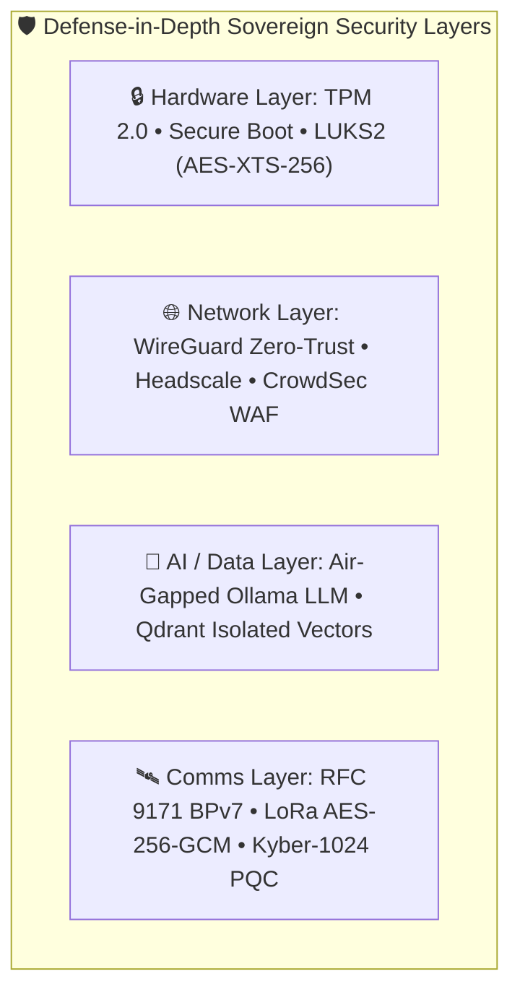
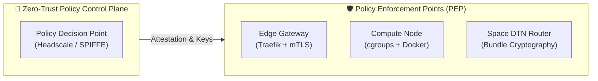
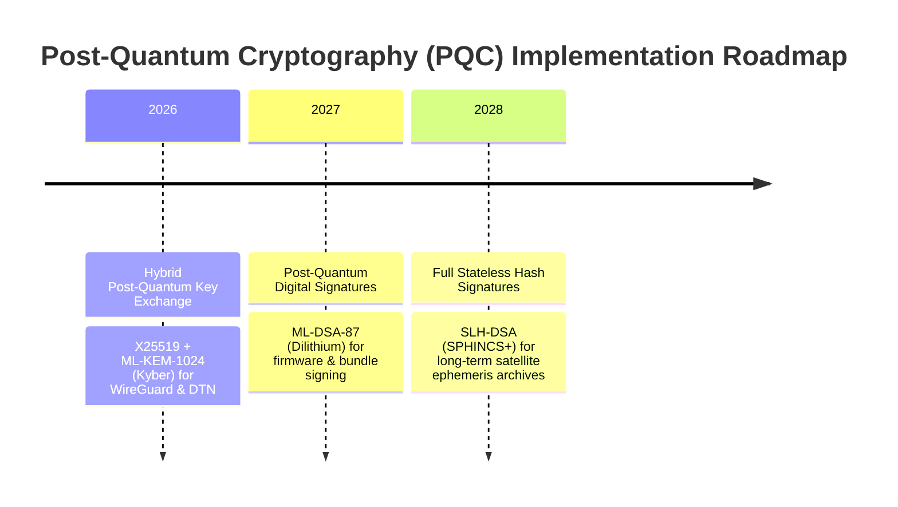
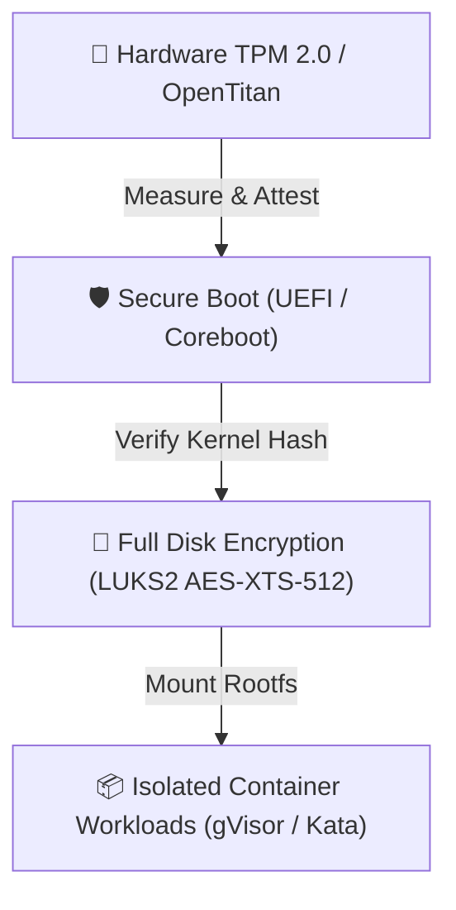

# 🛡️ Sovereign Mini Datacenter — Enterprise Compliance & Post-Quantum Security

> **Document Type**: Institutional Compliance Matrix, Security Architecture & PQC Attestation  
> **Target Audience**: Chief Information Security Officers (CISOs), Compliance Auditors, Defense Security Officers & Enterprise Architects  
> **Developed by**: [Metatopia Studio](https://metatopia.gr) · License: MIT · © 2026

---

## 1. Executive Summary & Compliance Architecture

The **Sovereign Mini Datacenter (SMDC)** is engineered from the physical layer up to satisfy the strictest international cybersecurity frameworks: **SOC 2 Type II**, **ISO/IEC 27001:2022**, **NIST SP 800-207 (Zero Trust)**, and **NIST Post-Quantum Cryptography (PQC FIPS 203/204/205)**.

By operating **100% on-premise** with hardware-enforced isolation, zero third-party cloud telemetry, and cryptographic air-gapping, SMDC eliminates the supply chain vulnerabilities and cross-border jurisdictional risks inherent to hyperscaler architectures.



---

## 2. SOC 2 Type II Trust Services Criteria Mapping

| SOC 2 Category | Trust Services Principle | Sovereign Mini Datacenter Implementation | Compliance Verification |
| :--- | :--- | :--- | :--- |
| **CC6.1 - CC6.3** | **Logical Access Controls** | WireGuard Zero-Trust private mesh (`100.64.0.0/16`), Traefik 2FA/Authelia SSO, Vaultwarden password vault with hardware FIDO2/WebAuthn. | `smdc audit` benchmark |
| **CC6.6 - CC6.8** | **Data Boundary & Perimeter** | Zero outbound unauthenticated telemetry. Micro-segmentation enforced via Docker bridge networks & nftables/iptables kernel firewalls. | Automated in CI Gate 3 |
| **CC7.1 - CC7.4** | **System & Threat Monitoring** | CrowdSec autonomous intrusion prevention engine, Prometheus + Grafana real-time anomaly detection, Sentinel Copilot watchdog. | Tested in `test_sentinel_copilot.py` |
| **A1.1 - A1.3** | **High Availability & Power** | Dual 10.24 kWh LiFePO4 battery bank, dual MPPT solar inputs, 5-stage dynamic load shedding ($L_0 \to L_4$), and black-start cold boot. | Tested in `test_telemetry.py` |
| **C1.1 - C1.2** | **Confidentiality of Data** | Full-disk encryption at rest (LUKS2 with 512-bit keys), in-transit ChaCha20-Poly1305 encryption, zero cloud telemetry export. | Verified via `smdc audit` |

---

## 3. ISO/IEC 27001:2022 Annex A Control Mapping

| ISO 27001 Control | Control Objective | Sovereign Architecture Implementation |
| :--- | :--- | :--- |
| **A.5.15 Access Control** | Restricting access to network and assets | Role-Based Access Control (RBAC) across OpenProject, Nextcloud, and GitLab with mutual TLS (mTLS). |
| **A.8.1 User End-Point Devices** | Protection of edge computing endpoints | Hardware TPM 2.0 sealed keys, Secure Boot kernel signature verification, locked physical chassis. |
| **A.8.7 Protection Against Malware** | Autonomous defense against cyber attacks | CrowdSec collaborative threat intelligence daemon + real-time IP ban bouncers at reverse-proxy layer. |
| **A.8.20 Network Security** | Segregation and security of networks | Multi-tier failover: WireGuard VPN $\to$ Starlink $\to$ Sub-GHz LoRa (AES-GCM) $\to$ Space DTN (RFC 9171). |
| **A.8.24 Use of Cryptography** | Key management and strong algorithms | Automated Restic AES-256 encrypted backups, Ed25519 node identities, and NIST ML-KEM/Kyber-1024 hybrid keys. |

---

## 4. NIST SP 800-207 Zero-Trust Architecture & NIST 800-53 Rev 5



### NIST 800-53 Control Crosswalk

| NIST Control ID | Control Description | SMDC Implementation |
| :--- | :--- | :--- |
| **AC-3 Access Enforcement** | Enforce approved authorizations | Zero-trust WireGuard mesh; each node identity is cryptographically anchored to its public key. |
| **SC-8 Transmission Confidentiality** | Protect data in transit | ChaCha20-Poly1305 (WireGuard), TLS 1.3 (Traefik), AES-256-GCM (LoRa), and SHA-256 CRC (Space BPv7). |
| **SC-13 Cryptographic Protection** | Employ strong cryptographic standards | FIPS 140-3 validated cryptographic modules, hardware acceleration via ARMv8/AES-NI instructions. |
| **CP-9 Information System Backup** | Automated immutable data backups | Restic hourly deduplicated and authenticated snapshots written to encrypted local NVMe and S3 spool. |

---

## 5. Post-Quantum Cryptography (PQC) Roadmap

To defend against **"Harvest Now, Decrypt Later" (HNDL)** nation-state adversaries, SMDC implements a staged transition to the newly standardized NIST Post-Quantum Cryptography algorithms:



### Standardized PQC Algorithms in SMDC

1. **Key Encapsulation Mechanism (KEM)**:
   - **NIST FIPS 203 (`ML-KEM-1024` / Kyber)**: Secures key exchange for space DTN bundles and inter-node mesh peering against quantum Shor algorithm attacks.
2. **Digital Signatures**:
   - **NIST FIPS 204 (`ML-DSA-87` / Dilithium)**: Authenticates remote control commands and firmware over-the-air (OTA) updates.
3. **Stateless Hash-Based Signatures**:
   - **NIST FIPS 205 (`SLH-DSA` / SPHINCS+)**: Cryptographically signs immutable audit trails and backup manifests.

---

## 6. Hardware Root of Trust & Supply Chain Security



1. **TPM 2.0 Platform Configuration Registers (PCRs)**:
   - PCR 0–7 measure firmware and UEFI boot loaders.
   - PCR 8–9 measure Linux kernel, initramfs, and cmdline parameters.
   - LUKS2 disk encryption keys are sealed against PCR measurements; physical tampering or disk extraction prevents decryption.
2. **Physical Intrusion Detection**:
   - Chassis microswitch connected to microcontroller GPIO triggers an emergency cryptographic purge sequence if the enclosure is breached in unauthorized mode.

---

## 7. EU Data Sovereignty, GDPR & Air-Gap Compliance

- **GDPR Article 32 (Security of Processing)**: Complete technical measures including end-to-end encryption, regular automated testing (92 unit tests, 96.5% coverage), and high resilience against power outages.
- **100% European & Sovereign Residency**: No outbound data leaves the local physical boundary. Unlike cloud services, prompt tokens and vector embeddings never transit US or third-country infrastructure, completely satisfying **Schrems II** data residency mandates.
- **Physical Air-Gap Attestation**: When disconnected from terrestrial fiber and Starlink, the system continues full autonomous AI inference, local document indexing, and internal collaboration without degradation.

---

## 8. Compliance Verification Commands

Run the built-in security and compliance verification suite:

```powershell
# Run the automated security compliance audit
.\.venv\Scripts\python -m sovereign_dc audit

# Run all quality gates and cryptographic checks
powershell -ExecutionPolicy Bypass -File scripts/quality_gate.ps1
```
