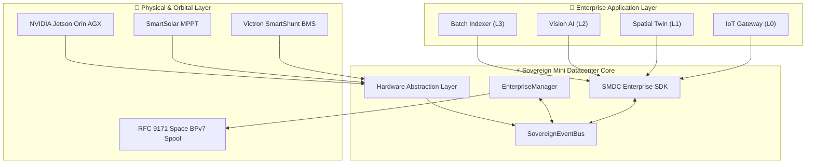
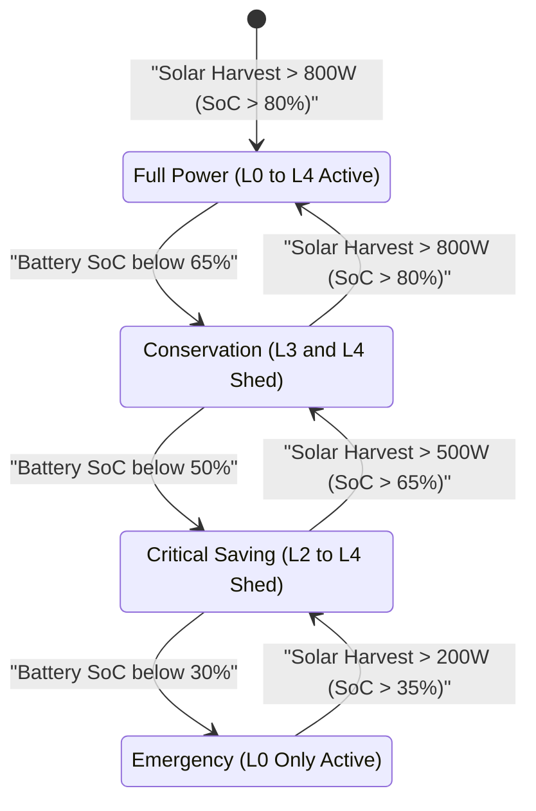

# 🏢 Enterprise Application Onboarding & Coupling Guide

> **Sovereign Mini Datacenter (SMDC)**  
> **Target Audience**: Enterprise Software Engineers, Cloud/Edge Architects, DevOps & Systems Integrators  
> **Scope**: Declarative manifest specification (`smdc-app.yaml`), zero-dependency SDK (`sovereign_dc.enterprise.sdk`), solar-aware power tiers, lifecycle management, and Post-Quantum Cryptography packaging.

---

## 1. Executive Summary & Value Proposition

The **Sovereign Mini Datacenter (SMDC)** enterprise framework enables organizations to deploy, manage, and scale their proprietary or open-source software workloads on sovereign, off-grid, solar-backed edge compute nodes without cloud lock-in.

Whether deploying industrial IoT pipelines, computer vision models, geospatial digital twins, or confidential databases, the SMDC runtime guarantees:

1. **Hardware-Enforced Energy Sovereignty**: Workloads automatically adapt to available solar generation and battery State-of-Charge (SoC) through graduated power tiers ($L_0 \to L_4$).
2. **Post-Quantum Cryptographic Attestation**: Application bundles and inter-node transactions are signed using lattice-based NIST FIPS 204 ML-DSA-87 algorithms.
3. **Delay-Tolerant Space Relaying**: Integrated RFC 9171 BPv7 DTN communication spools critical event payloads directly to Low Earth Orbit (LEO) satellite constellations during terrestrial link outages.
4. **Autonomous AI Multi-Agent Supervision**: Built-in Sentinel and Technician Copilots monitor workload health, resource quotas, and thermals.



---

## 2. The Application Manifest Specification (`smdc-app.yaml`)

Every enterprise application contains a root descriptor named `smdc-app.yaml` (or `smdc-app.json`).

### Full Schema Reference

```yaml
# Sovereign Mini Datacenter (SMDC) — Enterprise Application Manifest
name: "Smart Factory Analytics"
app_id: "smart-factory-analytics"
version: "1.0.0"
description: "Real-time edge analytics and predictive maintenance for assembly line sensors."
author: "Factory Automation Group"
category: "ai_inference" # iot | ai_inference | spatial_media | database | distributed | web_service | custom
runtime: "process"       # process | docker | systemd | patch

# Execution Entrypoint
entrypoint: "python3 main.py --config config.json"

# Hardware Resource Allocations
resources:
  cpu_cores: 2.0         # Fractional CPU core allocation
  ram_mb: 2048           # Memory reservation in Megabytes
  gpu_vram_mb: 2048      # GPU memory quota in Megabytes
  storage_mb: 4096       # Local NVMe disk quota
  gpu_required: true     # NVIDIA CUDA / TensorRT dependency
  max_power_w: 35.0      # Maximum expected electrical draw in Watts

# Power Shedding & Environmental Policies
power:
  tier: "L2_BACKGROUND"  # L0_CRITICAL | L1_STANDARD | L2_BACKGROUND | L3_DEFERRABLE | L4_IDLE
  min_battery_soc: 40.0  # Minimum battery SoC percentage required to run
  max_ambient_temp_c: 55.0 # Thermal throttling cutoff temperature in Celsius
  allow_solar_burst: true # Allow bursting when solar harvest exceeds 500 W
  min_solar_watts: 250.0  # Minimum solar PV wattage required to resume execution

# Network & Multi-Spectral Connectivity
network:
  ports: [8080, 8443]    # Listening service ports
  expose_wireguard: true # Peered across zero-trust WireGuard mesh
  space_dtn_enabled: true # Authorized to spool RFC 9171 BPv7 satellite bundles
  lora_heartbeat: true   # Transmit emergency telemetry over Sub-GHz LoRa

# Storage Persistence & Backup
storage:
  persistent_volume: "factory-analytics-data"
  mount_point: "/var/lib/smdc/apps/smart-factory-analytics/data"
  backup_enabled: true   # Included in Restic encrypted off-site snapshots

# Health Probes & Auto-Restart
health_check:
  type: "http"           # http | tcp | process
  endpoint: "/health"
  port: 8080
  interval_sec: 15
  timeout_sec: 5
  max_retries: 3
```

---

## 3. Power Shedding Tiers ($L_0 \to L_4$)

The SMDC Sentinel Copilot dynamically manages running workloads according to battery and solar availability:

| Tier | Priority Name | Target Workloads | Shedding Trigger | Behavior |
| :--- | :--- | :--- | :--- | :--- |
| **$L_0$** | `L0_CRITICAL` | BMS, Life Support, Telemetry, LoRa Gateway, Security Vault | $\text{SoC} < 15\%$ | **Never throttled**; highest priority. |
| **$L_1$** | `L1_STANDARD` | Core Web APIs, Spatial Twins, Low-Power Inference | $\text{SoC} < 30\%$ | Gracefully throttled or throttled to lower frequency. |
| **$L_2$** | `L2_BACKGROUND` | Computer Vision Pipelines, Real-Time Ingestion | $\text{SoC} < 50\%$ or High Thermals | **Automatically paused**; resumes upon solar surplus. |
| **$L_3$** | `L3_DEFERRABLE` | Model Retraining, Document Vectorization (RAG), Archival Sync | $\text{SoC} < 65\%$ | Scheduled strictly during daylight solar peaks ($> 500\text{ W}$). |
| **$L_4$** | `L4_IDLE` | Speculative Compute, Benchmark Sweeps, DePIN Idle Relays | $\text{SoC} < 80\%$ | Immediately terminated during any power deficit. |



---

## 4. Step-by-Step Developer Onboarding Tutorial

### Step 1: Initialize Project Scaffold
Use the `smdc app init` command to create a starter repository:

```bash
smdc app init \
  --name "Predictive Maintenance" \
  --app-id "predictive-maint" \
  --category ai_inference \
  --runtime process \
  --power-tier L2_BACKGROUND \
  --entrypoint "python3 app.py" \
  --gpu \
  ./predictive-maint
```

This generates:
- `smdc-app.yaml`: Canonical manifest descriptor
- `smdc-app.json`: JSON schema equivalent
- `app.py`: Starter Python code wired to `sovereign_dc.enterprise.sdk`
- `Dockerfile`: Multi-architecture container recipe
- `README.md`: Project documentation

---

### Step 2: Implement Application Logic with SMDC SDK

```python
"""Predictive Maintenance Engine with SMDC SDK Integration."""

import logging
import time
from sovereign_dc.enterprise.sdk import SMDCClient, AppLifecycleHandler

logging.basicConfig(level=logging.INFO)
logger = logging.getLogger("predictive-maint")

def on_power_shed():
    logger.warning("Low solar/battery detected. Saving model checkpoint and pausing...")

def on_power_resume():
    logger.info("Solar power restored. Resuming vibration analysis...")

def main():
    # 1. Connect zero-dependency SMDC client
    client = SMDCClient()
    
    # 2. Hook lifecycle and power management signals
    lifecycle = AppLifecycleHandler(
        "predictive-maint",
        client=client,
        on_pause=on_power_shed,
        on_resume=on_power_resume,
    )

    while lifecycle.is_running:
        if lifecycle.is_paused:
            time.sleep(1.0)
            continue

        # 3. Read live datacenter power telemetry
        telemetry = client.get_telemetry()
        soc = telemetry.get("battery_soc", 100.0)

        # 4. Perform domain computation
        vibration_score = 0.12

        # 5. Emit custom enterprise metrics to SMDC telemetry pipeline
        client.emit_telemetry("predictive-maint", {
            "vibration_score": vibration_score,
            "anomaly_detected": False,
            "soc": soc
        })

        time.sleep(3.0)

if __name__ == "__main__":
    main()
```

---

### Step 3: Validate and Register the Application

```bash
# Validate manifest constraints and syntax
smdc app validate ./predictive-maint

# Register application on local node registry
smdc app register ./predictive-maint

# Verify registration
smdc app list
```

---

### Step 4: Manage Application Lifecycle

```bash
# Start the application
smdc app start predictive-maint

# Check real-time process health, power draw, and metrics
smdc app status predictive-maint

# Restart application
smdc app restart predictive-maint

# Stop application
smdc app stop predictive-maint
```

---

### Step 5: Package and Sign with Post-Quantum Cryptography

For enterprise distribution across remote edge clusters, package the application into a verifiable `.smdc-app` archive:

```bash
smdc app package ./predictive-maint --output predictive-maint-1.0.0.smdc-app
```

Output:
```
[INFO] Packaging enterprise application directory: ./predictive-maint
[INFO] Computed SHA-256 Digest: e3b0c44298fc1c149afbf4c8996fb92427ae41e4649b934ca495991b7852b855
[INFO] Generating Post-Quantum Signature (NIST FIPS 204 ML-DSA-87)...
[INFO] Created signature sidecar: predictive-maint-1.0.0.smdc-app.sig
[SUCCESS] Application packaged to predictive-maint-1.0.0.smdc-app
```

---

## 5. Model Context Protocol (MCP) Integration for Autonomous Agents

AI Assistants (Antigravity, Claude, Cursor) can directly interact with enterprise workloads via standard MCP endpoints:

- **Tools**:
  - `list_enterprise_apps`: Query all onboarded apps and live runtime states.
  - `manage_enterprise_app`: Execute `start`, `stop`, `restart`, `pause`, or `resume`.
  - `scaffold_enterprise_app`: Programmatically generate an `smdc-app.yaml` manifest.
- **Resources**:
  - `smdc://enterprise/apps`: Real-time JSON snapshot of all registered enterprise workloads.
  - `smdc://enterprise/schema`: Canonical JSON schema for manifest verification.
- **Prompts**:
  - `onboard_enterprise_workload`: Guided interactive workflow for sizing and provisioning enterprise projects.
