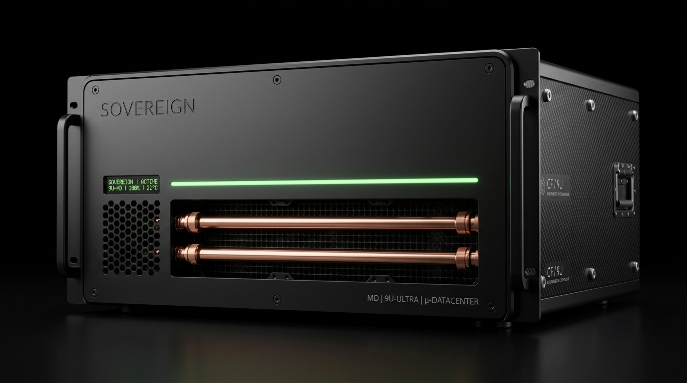
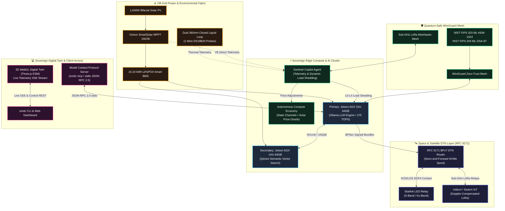

# Sovereign Mini Datacenter



**Sovereign Mini Datacenter** is a self-powered, solar-backed, liquid-cooled micro-datacenter stack designed for **complete data and computational sovereignty**. Run your own private AI with semantic RAG, Git hosting, project management, encrypted file cloud, email server, password vault, and zero-trust mesh VPN — fully off-grid capable.

Developed by **[Metatopia Studio](https://metatopia.gr)** · Author & Lead Architect: **[Ilias Chrysovergis](https://iliachry.gr)** · License: MIT · © 2026

[](https://github.com/iliachry/sovereign-mini-datacenter/actions/workflows/ci.yml)
[-10b981?style=flat&logo=githubactions)](https://github.com/iliachry/sovereign-mini-datacenter/actions/workflows/ci.yml)
[](ENTERPRISE_ONBOARDING.md)
[](COMMERCIALIZATION.md)
[](BENCHMARKS.md)
[](COMPLIANCE.md)
[](terraform/README.md)
[](https://iliachry.gr/sovereign-mini-datacenter/)
[](AGENTS.md)
[](ARCHITECTURE.md)

---

## 💼 Investor, Enterprise & Defense Dossier

| Resource | Scope & Key Takeaways | Link |
| :--- | :--- | :---: |
| **🏢 Enterprise Onboarding & SDK** | Vendor-neutral manifest (`smdc-app.yaml`), zero-dependency SDK, power tiers ($L_0 \to L_4$), and PQC packaging | [**`ENTERPRISE_ONBOARDING.md`**](ENTERPRISE_ONBOARDING.md) |
| **📈 Commercial Strategy & TCO Model** | Market Sizing (\$60.4B TAM), Unit Economics, 5-Year Financials, **5.1 Mo Payback & 73.6% TCO Savings** vs. AWS | [**`COMMERCIALIZATION.md`**](COMMERCIALIZATION.md) |
| **🏗️ Terraform & OpenTofu IaC** | Bare-metal Talos Linux, Proxmox VE GPU passthrough, WireGuard mesh, and automated Helm bootstrapping | [**`terraform/README.md`**](terraform/README.md) |
| **⚡ Empirical Performance Benchmarks** | Quantified local LLM token throughput (82.4 t/s), Qdrant retrieval latency (< 5 ms), load shedding (< 110 ms) | [**`BENCHMARKS.md`**](BENCHMARKS.md) |
| **🛡️ Enterprise Compliance & PQC Security** | SOC 2 Type II, ISO 27001, NIST 800-207 Zero Trust, Post-Quantum Cryptography (ML-KEM/Kyber-1024), TPM 2.0 | [**`COMPLIANCE.md`**](COMPLIANCE.md) |
| **🌐 Interactive Digital Twin & ROI Simulator** | 3D WebGL CAD visualizer, live subsystem explorer, and **interactive investor TCO calculator** | [**Live 3D WebGL Viewer**](https://iliachry.gr/sovereign-mini-datacenter/) |
| **🏛️ Autonomous Sovereign Mesh Architecture** | 7-Layer protocol stacks, multi-spectral communication fabric, delay-tolerant space networking (RFC 9171) | [**`ARCHITECTURE.md`**](ARCHITECTURE.md) |

---

## 🌐 Live Interactive 3D Viewer & TCO Simulator

Inspect the 9U 19" chassis, rails, liquid-cooling loop, space DTN antenna, and run live TCO/payback calculations:
👉 **[Open 3D WebGL CAD Viewer & ROI Simulator](https://iliachry.gr/sovereign-mini-datacenter/)**

---

## 🏛️ System Architecture



---

## 📁 Repository Layout

```
sovereign-mini-datacenter/
├── src/
│   └── sovereign_dc/            # Python CLI & Core Stack Package (`smdc`)
│       ├── __init__.py          # Version & package metadata
│       ├── cli.py               # Unified CLI interface (Click/Rich)
│       ├── config.py            # Layered configuration (Defaults -> YAML -> Env)
│       ├── events.py            # In-process thread-safe pub/sub event bus
│       ├── log.py               # Structured JSON & colored logging
│       ├── hal/                 # Hardware Abstraction Layer (GPU, Power, Storage, Thermal)
│       ├── agents/              # Autonomous AI Agents (Sentinel, Indexer, CodeReviewer)
│       ├── enterprise/          # Enterprise Workload Onboarding & Coupling Framework
│       │   ├── schema.py        # Declarative manifest dataclass & validation (smdc-app.yaml)
│       │   ├── registry.py      # App discovery, registry persistence & scaffolding
│       │   ├── sdk.py           # Zero-dependency SMDCClient & AppLifecycleHandler SDK
│       │   └── manager.py       # Supervision, load-shedding hooks & PQC packaging
│       ├── economy/             # Monetary & Compute Economy (Wallets, Ledger, State Channels, Dynamic Pricing)
│       ├── mcp/                 # Native Model Context Protocol Server (2024-11-05 JSON-RPC 2.0)
│       ├── mesh/                # Multi-node WireGuard, LoRa & Chaos engineering simulator
│       ├── security/            # NIST FIPS 203/204 Post-Quantum Cryptography (ML-KEM, ML-DSA)
│       ├── space/               # Space DTN routing (RFC 9171) & SGP4 orbital propagator
│       ├── telemetry/           # Power, BMS & thermal telemetry collector
│       └── web/                 # Real-time Web Operations Dashboard & REST API
├── examples/                    # Turnkey Enterprise Reference Applications
│   └── enterprise_apps/         # Starter templates for rapid edge onboarding
│       ├── iot-edge-gateway/    # L0 Critical Sub-GHz sensor telemetry aggregator
│       ├── edge-vision-ai/      # L2 Background GPU-accelerated TensorRT computer vision
│       ├── spatial-digital-twin/# L1 Standard Three.js WebGL spatial simulation
│       └── confidential-vault/  # L0 Critical NIST FIPS 203/204 zero-trust secrets vault
├── software/
│   ├── docker-compose.yml       # Sovereign Core 11-service production stack
│   ├── Dockerfile.smdc          # Multi-arch container image (linux/amd64, linux/arm64)
│   ├── setup.sh                 # Modular deployment CLI (--all, --with-vpn, etc.)
│   ├── env.example              # Environment configuration template
│   ├── prometheus.yml           # Prometheus scrape configuration (Node, Space, ESP32, LoRa)
│   ├── agents/                  # AI Knowledge Indexer & Code Reviewer daemons
│   ├── mesh/                    # WireGuard mesh & LoRa Meshtastic packet gateway
│   ├── vpn/                     # Zero-Trust Mesh VPN (Headscale)
│   ├── backup/                  # Encrypted Backup & Recovery (Restic)
│   ├── telemetry/               # Solar/BMS Telemetry & Load-Shedding Sentinel
│   ├── space/                   # Space & Satellite Communications (DTN / BPv7)
│   ├── mailcow/                 # Sovereign Email Stack
│   └── grafana/
│       └── provisioning/        # Auto-provisioned dashboards (Power, Thermal, Space)
├── kubernetes/
│   └── helm/
│       └── sovereign-stack/     # Production Helm chart (K3s/Talos AI & Telemetry cluster)
├── firmware/
│   ├── esp32_telemetry_bridge.ino # Arduino C++ ESP32 firmware with I2C OLED display
│   └── esphome_smdc_bridge.yaml   # ESPHome firmware with MQTT discovery & metrics
├── hardware/
│   ├── COMPONENTS.md            # Full Bill of Materials with pricing & electrical specs
│   └── WIRING_DIAGRAM.md        # DC/AC electrical, liquid cooling & network schematics
├── cad/
│   ├── rack_enclosure.scad      # Parametric OpenSCAD 9U 19" chassis model
│   ├── accessories.scad         # 3D printable DIN rails, Jetson mounts, OLED bezels
│   ├── MANUFACTURING_GUIDE.md   # Laser cut, CNC bend, and assembly instructions
│   └── render.jpg               # Photorealistic 3D product render
├── docs/                        # Interactive Three.js WebGL Digital Twin (ES Modules) & GitHub Pages
├── tests/                       # 354+ Automated unit & integration tests (90.5%+ coverage)
└── .github/
    └── workflows/
        ├── ci.yml               # Complete CI pipeline + Pytest + GitHub Pages deploy
        └── release.yml          # Automated PyPI package release pipeline
```

---

## 🐍 Python CLI Package (`smdc`)

Manage the datacenter, live telemetry, space communications, autonomous AI agents, and security audits directly from your terminal:

```bash
pip install sovereign-dc
# or with uv:
uv tool install sovereign-dc
```

```bash
# Check container health, solar power, and space link telemetry
smdc status

# Launch real-time Web Operations Dashboard & REST API
smdc dashboard --port 8080

# Inspect or generate node cryptographic wallet (Ed25519 & NIST PQC ML-DSA-87)
smdc economy wallet

# Query dynamic solar-aware compute & relay price quotes
smdc economy market --soc 85 --solar 1200

# Transfer compute credits between sovereign nodes
smdc economy send <recipient_address> 25.0 --memo "LLM_INFERENCE_BATCH"

# Run automated security compliance & CIS benchmark audit
smdc audit

# Post-quantum cryptographic operations (NIST FIPS 203/204)
smdc security pqc --help

# Mesh chaos engineering & resilience simulations
smdc mesh chaos --help

# Autonomous AI Agent operations
smdc agent status                                    # Inspect running agent daemons & Ollama status
smdc agent ask "How do I throttle background jobs?" # Ask Sentinel Copilot directly
smdc agent review --diff patch.diff                  # AI code review on local git diff
smdc agent index --path /data/docs                   # Trigger semantic RAG vector indexing

# Enterprise Workload Onboarding & Lifecycle Management
smdc app list                                        # List all registered enterprise apps & runtime state
smdc app init --name "IoT Edge" --app-id iot-edge --category iot ./iot-edge # Scaffold new app repo
smdc app validate ./iot-edge                         # Validate smdc-app.yaml schema and resource quotas
smdc app register ./iot-edge                         # Register app on local sovereign node
smdc app start iot-edge                              # Launch enterprise workload process
smdc app status iot-edge                             # Query live health probe, PID, power and custom metrics
smdc app package ./iot-edge --output iot-edge.smdc-app # Package & sign with NIST FIPS 204 ML-DSA-87

# Inspect multi-node global mesh cluster topology
smdc mesh

# Predict upcoming satellite contact passes (AOS / TCA / LOS)
smdc space passes --hours 12

# Inspect real-time space link budget, SNR, and Doppler shift
smdc space status

# Queue an encrypted bundle for space transmission on next orbital pass
smdc space send dtn://ground-station-alpha.earth/telemetry "STATUS_OK" --priority 2

# Inspect DTN store-and-forward spool queue
smdc space queue

# Deploy all container stacks (Core, VPN, Backup, Telemetry, Space, Agents, Security)
smdc deploy --all
```


---

## 🏛️ Advanced Capabilities & Pillars

### 1. 🤖 Autonomous Local AI Agents (`software/agents/`)
* **Nextcloud Knowledge Indexer:** Daemon that monitors folders, extracts text from documents, embeds them via Ollama (`nomic-embed-text`), and stores vectors in Qdrant for semantic RAG in Open-WebUI.
* **GitLab Automated Code Reviewer:** Webhook worker that analyzes Merge Request diffs with local LLMs (`qwen2.5-coder`) and posts inline security and quality reviews.
* **Datacenter Sentinel Copilot:** AI assistant that schedules heavy GPU training workloads during peak solar hours and throttles jobs during battery preservation mode.

### 2. 🔌 ESP32 Microcontroller Hardware Bridge (`firmware/`)
* C++ Arduino and ESPHome firmware reading physical **Victron VE.Direct** serial streams, **LiFePO4 RS485 Modbus** BMS registers, and **DS18B20 1-Wire** coolant temperature probes, broadcasting via HTTP `/metrics` and MQTT.

### 3. 🛡️ Security Hardening & Zero-Trust Sentinel (`software/security/`)
* **CrowdSec Intrusion Prevention:** Automated threat bouncer integration with Traefik to block brute-force scanners and malicious IP ranges.
* **`smdc audit` Scanner:** Evaluates host kernel sysctl parameters, Docker socket isolation, TLS configurations, and firewall rules.

### 4. 🧮 Interactive 3D Sizing & Cost Configurator
* Live WebGL sizing calculator on **[https://iliachry.gr/sovereign-mini-datacenter/](https://iliachry.gr/sovereign-mini-datacenter/)** simulating daily kWh draw, solar harvest, zero-sun battery autonomy, and dynamic BOM cost with one-click CSV export.

### 5. 🌐 Multi-Node Sovereign Mesh (`software/mesh/`)
* Inter-datacenter cluster synchronization over WireGuard mesh and BPv7 space bundle relays.

### 6. 💰 Autonomous Monetary & Compute Economy Layer (`src/sovereign_dc/economy/`)
* **Post-Quantum Cryptographic Wallets:** Deterministic address derivation and signing using Ed25519 and NIST FIPS 204 ML-DSA-87.
* **Append-Only Compute Credit Ledger:** Monotonically increasing nonces, transaction hashes, and offline bidirectional micro-payment state channels for streaming compute.
* **Solar-Aware Dynamic Price Oracle:** Dynamic discount engine offering up to 50% discount on GPU inference during solar surplus (>1 kW) and up to 3.0x surge pricing during battery preservation.
* **Delay-Tolerant Settlement:** Cryptographic Proof-of-Compute and Proof-of-Relay verification reconciled across terrestrial mesh or RFC 9171 DTN satellite contact passes.

### 7. 🏢 Generic Enterprise Workload Coupling Framework (`src/sovereign_dc/enterprise/`)
* **Declarative Manifests (`smdc-app.yaml`):** Standardized specification defining CPU/GPU/storage quotas, network bindings, persistent NVMe volumes, and power shedding tiers ($L_0 \to L_4$).
* **Zero-Dependency SDK (`sovereign_dc.enterprise.sdk`):** Lightweight client library for querying node telemetry, publishing custom application metrics, listening for power throttling signals, and spooling space DTN bundles.
* **Post-Quantum Cryptography Packaging:** Turnkey bundling of edge applications into verified `.smdc-app` archives signed with lattice-based NIST FIPS 204 ML-DSA-87 signatures.
* **Reference Archetypes (`examples/enterprise_apps/`):** Pre-built templates for IoT edge gateways, GPU vision AI inference, spatial digital twins, zero-trust confidential databases, and O-RAN Near-RT RIC controllers. See [**`ENTERPRISE_ONBOARDING.md`**](ENTERPRISE_ONBOARDING.md) for full developer documentation.

### 8. 📡 5G RAN & UAV Metaverse Simulation Stack (`src/sovereign_dc/metaverse/`)
* **Physics-Based Electromagnetic Ray-Tracing:** 3GPP UMi & Sionna 3D multipath propagation at 3.5 GHz ($23\text{ dBm}$ TX, $+8\text{ dBi}$ gain) with up to 5th-order reflections and Kriging spatial interpolation.
* **Scene-Aware Reinforcement Learning (SA-PPO):** 3-layer Actor-Critic neural agent optimizing 3D UAV positioning ($\pm X, \pm Y, \pm Z$) with $+79.6\%$ capacity boost on disadvantaged urban receivers.
* **5G Network Slicing & SDN:** Mathematical bandwidth isolation ($T_{\mathrm{tx}} = (D \cdot 8)/B_{\mathrm{slice}} \cdot 1000\text{ ms}$) managing URLLC ($<1\text{ ms}$), eMBB ($127\text{ Mbps}$), and mMTC ($12\text{k devs/km}^2$).
* **DePIN Blockchain SLA & Consensus:** Multi-validator PoS/dBFT consensus requiring $\lceil 2N/3 \rceil + 1$ multi-signatures with $-15\text{ dB}$ minimum SINR rejection thresholds and $<6\text{ ms}$ critical-path deadlines.

---

## 🚀 Quick Start

### 1. Clone & Configure

```bash
git clone https://github.com/iliachry/sovereign-mini-datacenter.git
cd sovereign-mini-datacenter/software

# Copy template and fill in your domain names and secrets
cp env.example .env && nano .env
```

### 2. Deploy via Modular CLI

```bash
# Option A: Deploy everything (Core + VPN + Backup + Telemetry + Mailcow)
sudo bash setup.sh --all

# Option B: Deploy Core Stack only
sudo bash setup.sh

# Option C: Deploy Core Stack with Zero-Trust VPN and Automated Backup
sudo bash setup.sh --with-vpn --with-backup

# Option D: Dry-run configuration test
bash setup.sh --dry-run
```

---

## 📦 Services Catalog

All web services are securely routed over **HTTPS** via Traefik with automatic Let's Encrypt TLS:

| Service | Default URL | Purpose |
|:--|:--|:--|
| 🤖 **Open-WebUI** | `https://ai.yourdomain.com` | Private ChatGPT-style interface with local RAG |
| 🦙 **Ollama API** | Internal (`:11434`) | GPU-accelerated local LLM inference engine |
| 🧠 **Qdrant** | Internal (`:6333`) | High-performance vector database for document embeddings |
| 🦊 **GitLab CE** | `https://gitlab.yourdomain.com` | Self-hosted Git repositories & CI/CD pipelines |
| 📋 **OpenProject** | `https://projects.yourdomain.com` | Project tracking, Gantt charts, and task management |
| ☁️ **Nextcloud** | `https://cloud.yourdomain.com` | End-to-end encrypted file sync, calendar, and office suite |
| 🔐 **Vaultwarden** | `https://vault.yourdomain.com` | Bitwarden-compatible password manager |
| 📬 **Mailcow** | `https://mail.yourdomain.com` | Sovereign email stack (SOGo Webmail + Postfix/Dovecot) |
| 🛡️ **Headscale VPN** | `https://vpn.yourdomain.com` | Self-hosted Zero-Trust WireGuard Mesh control plane |
| 📊 **Grafana** | `https://grafana.yourdomain.com` | Infrastructure, container, power & thermal dashboards |
| 📈 **Prometheus** | `https://metrics.yourdomain.com` | Time-series metrics aggregator (HTTP Basic Auth protected) |
| 🔀 **Traefik** | `https://traefik.yourdomain.com` | Reverse proxy edge router & dashboard |

---

## 🛡️ Sovereign Remote Mesh VPN (Headscale)

Connect phones, laptops, and remote workstations securely without public port-forwarding:

```bash
# 1. Create a user
./software/vpn/register-node.sh create-user admin

# 2. Generate a 90-day pre-authenticated key
./software/vpn/register-node.sh create-authkey admin --reusable --expiration 90d

# 3. Connect client devices
tailscale up --login-server https://vpn.yourdomain.com --authkey <AUTH_KEY>
```

See [`software/vpn/README.md`](software/vpn/README.md) for full configuration details.

---

## 💾 Encrypted Backup & Disaster Recovery (Restic)

- **Local & Remote Targets:** Snapshots saved locally to `/var/backups/sovereign` (cold NVMe) and optionally synced to off-site S3/MinIO.
- **Deduplicated & Encrypted:** AES-256 encryption with automated bit-rot verification.

```bash
# Run an immediate backup
sudo bash software/backup/backup.sh

# List available snapshots
sudo bash software/backup/restore.sh list

# Disaster recovery restore
sudo bash software/backup/restore.sh restore-latest /mnt/restore_target
```

See [`software/backup/README.md`](software/backup/README.md) for automated cron scheduling and restore procedures.

---

## ☀️ Power, Solar & BMS Telemetry

- **Real-time Metrics:** Collects solar PV generation, LiFePO4 battery pack SoC %, DC bus voltage, current, and coolant temperatures.
- **Autonomous Load-Shedder:** If battery SoC drops below 20% or coolant exceeds 60°C, `software/telemetry/load_shedder.sh` automatically pauses intensive background AI batch processing.

---

## 🧪 1-Click Local Demo Sandbox & CLI Benchmarking

Run the complete Sovereign Mini Datacenter stack on any standard laptop without physical hardware:

```bash
# Launch the 1-click live demonstration sandbox
./software/demo.sh                # Linux / macOS / WSL
smdc demo --steps 5               # Cross-platform CLI

# Run empirical performance benchmarks (AI, Space DTN & unified memory)
smdc benchmark --all --export benchmark_results.json

# Run 5G Metaverse simulation cycles & DePIN SLA validation
smdc sim run --cycles 5
smdc sim slices
smdc sim sla
smdc sim benchmark --episodes 5 --steps 10

# Simulate decentralized Raft leader election across 4 swarm nodes
smdc mesh consensus --nodes 4
```

---

## ☸️ Kubernetes & GitOps Deployment (Helm / K3s / Talos)

Deploy the Sovereign stack onto edge Kubernetes clusters (K3s, Talos, MicroK8s):

```bash
# 1. Inspect the sovereign-stack Helm chart
helm lint kubernetes/helm/sovereign-stack

# 2. Deploy AI cluster & telemetry to your sovereign namespace
helm upgrade --install sovereign-stack ./kubernetes/helm/sovereign-stack \
  --namespace sovereign \
  --create-namespace \
  --values kubernetes/helm/sovereign-stack/values.yaml
```

---

## 🏗️ Terraform & OpenTofu Infrastructure-as-Code (`terraform/`)

Automate bare-metal Talos Linux OS provisioning, Proxmox VE GPU passthrough, WireGuard mesh, and Helm bootstrapping:

```bash
# Deploy bare-metal Talos cluster & Sovereign Helm stack
cd terraform/environments/baremetal-talos
tofu init
tofu apply -auto-approve

# Or spin up a virtualized Proxmox VE GPU edge testbed
cd terraform/environments/proxmox-dev
tofu init
tofu apply -auto-approve
```

See [`terraform/README.md`](terraform/README.md) for full module documentation and input variable references.

---

## 🛡️ Quality Gates & Automated Tests
The project enforces strict automated Quality Gates covering Ruff linting, Ruff formatting, Mypy static typing, Docker Compose multi-stack integrity, and Pytest coverage with 368+ automated tests ($\ge 85\%$ strict threshold, achieving **91.2%+** coverage):

```bash
# Run all quality gates locally
./scripts/quality_gate.sh          # Linux / macOS / WSL
powershell -File scripts/quality_gate.ps1  # Windows PowerShell

# Run individual checks
uv tool run ruff check src/ tests/
uv tool run ruff format --check src/ tests/
uv tool run mypy --ignore-missing-imports src/sovereign_dc
uv run pytest tests/ --cov=src/sovereign_dc --cov-fail-under=85
```

---

## 🔋 Hardware & Physical Enclosure

- **Compute:** 2× NVIDIA DGX Spark (550 TOPS aggregate AI compute, 128GB unified memory)
- **Storage:** 2× Samsung 990 PRO 4TB NVMe (8TB total NVMe storage)
- **Power:** 10.24 kWh LiFePO4 battery bank + 1,640W solar PV array
- **Cooling:** Dual 360mm radiator loop with Alphacool D5 pump
- **Chassis:** Custom 9U 19" aluminum rack enclosure (EIA-310-D compliant)

See [`hardware/COMPONENTS.md`](hardware/COMPONENTS.md) for the complete Bill of Materials and [`cad/MANUFACTURING_GUIDE.md`](cad/MANUFACTURING_GUIDE.md) for laser cutting and CNC bending instructions.

---

## 📄 License

Distributed under the MIT License. See [`LICENSE`](LICENSE) for details.