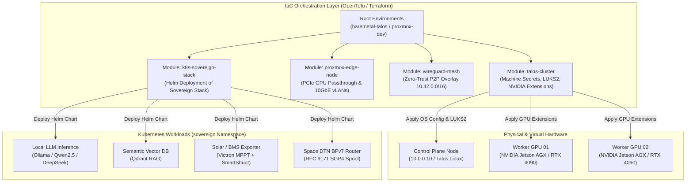

# 🏗️ Sovereign Mini Datacenter — Terraform & OpenTofu IaC

> **Infrastructure-as-Code (IaC)** for declarative, zero-cloud bare-metal and hypervisor provisioning of the **Sovereign Mini Datacenter (SMDC)** stack. Compatible with **OpenTofu ($\ge 1.7$)** and **Terraform ($\ge 1.6$)**.

---

## 1. Architectural Overview

The Terraform/OpenTofu architecture provides modular, vendor-agnostic infrastructure provisioning without relying on centralized cloud providers (AWS, GCP, Azure). It automates everything from bare-metal OS deployment to Kubernetes cluster bootstrapping and Helm workload orchestration.



---

## 2. Directory Structure

```
terraform/
├── README.md                           # This guide & architectural specification
├── versions.tf                         # Root provider versions & OpenTofu constraints
├── modules/
│   ├── talos-cluster/                  # Bare-metal Talos Linux OS & K8s bootstrapping
│   │   ├── main.tf                     # Talos secrets, machine configs, and kubeconfig
│   │   ├── variables.tf                # Cluster nodes, disks, network & LUKS options
│   │   ├── outputs.tf                  # Generated kubeconfig, talosconfig, and IPs
│   │   └── versions.tf
│   ├── proxmox-edge-node/              # Proxmox VE VM provisioning with PCIe passthrough
│   │   ├── main.tf                     # VM resources, virtio SCSI disks, GPU passthrough
│   │   ├── variables.tf                # CPU cores, RAM, datastore, PCI IDs
│   │   ├── outputs.tf                  # VM IDs, MAC addresses
│   │   └── versions.tf
│   ├── libvirt-edge-node/              # Local KVM / Libvirt development cluster
│   │   ├── main.tf                     # Libvirt domain & qcow2 volume resources
│   │   ├── variables.tf                # vCPU, memory, storage pool options
│   │   ├── outputs.tf                  # Domain IDs and DHCP leases
│   │   └── versions.tf
│   ├── wireguard-mesh/                 # Zero-trust peer-to-peer WireGuard mesh
│   │   ├── main.tf                     # Keypair generation and mesh configuration logic
│   │   ├── variables.tf                # Subnet (10.42.0.0/16), node endpoints & ports
│   │   ├── outputs.tf                  # Config files per node & public key map
│   │   ├── templates/wg.conf.tpl       # WireGuard configuration template
│   │   └── versions.tf
│   └── k8s-sovereign-stack/            # Helm deployment of kubernetes/helm/sovereign-stack
│       ├── main.tf                     # Helm release binding for AI, telemetry & DTN
│       ├── variables.tf                # Release namespace, GPU limit, AI models
│       ├── outputs.tf                  # Helm release status and namespace
│       └── versions.tf
└── environments/
    ├── baremetal-talos/                # Production bare-metal 3-node cluster deployment
    │   ├── main.tf                     # Integrates talos-cluster and k8s-sovereign-stack
    │   ├── variables.tf
    │   ├── terraform.tfvars.example    # Sample IPs, node hostnames, and install disks
    │   ├── outputs.tf
    │   └── versions.tf
    └── proxmox-dev/                    # Virtualized Proxmox VE testbed deployment
        ├── main.tf                     # Spawns virtual control plane and GPU worker VMs
        ├── variables.tf
        ├── terraform.tfvars.example    # Proxmox API token and node credentials
        ├── outputs.tf
        └── versions.tf
```

---

## 3. Module Index & Capabilities

| Module | Target | Key Features |
| :--- | :--- | :--- |
| **`talos-cluster`** | Bare-metal compute nodes | LUKS2 disk encryption, 10GbE network bonding, NVIDIA open GPU kernel modules & container toolkit extensions, zero-trust Talos API. |
| **`proxmox-edge-node`** | Proxmox VE hypervisors | Automated VM creation, PCIe GPU device passthrough (RTX 4090 / Jetson PCIe), VirtIO SCSI SSD storage with TRIM/discard. |
| **`libvirt-edge-node`** | Local Linux / KVM | Headless edge VM testbeds with host-passthrough CPU and bridged virtual networking. |
| **`wireguard-mesh`** | Multi-node edge mesh | Dynamic asymmetric key generation, preshared keys, automated `wg0.conf` generation for P2P mesh (`10.42.0.0/16`). |
| **`k8s-sovereign-stack`** | Kubernetes ($\ge 1.30$) | Automated deployment of [`kubernetes/helm/sovereign-stack`](../kubernetes/helm/sovereign-stack) with Ollama GPU allocation, Qdrant, Space DTN, and telemetry. |

---

## 4. Quickstart Guide

### Prerequisites
- **OpenTofu** ($\ge 1.7.0$) or **Terraform** ($\ge 1.6.0$) installed:
  ```bash
  tofu version
  ```
- **`talosctl`** CLI installed for interacting with Talos Linux nodes.
- **`kubectl`** and **`helm`** CLI tools.

---

### Option A — Deploy Bare-Metal Talos Cluster & Sovereign Stack

1. **Navigate to the Bare-Metal Environment**:
   ```bash
   cd terraform/environments/baremetal-talos
   ```

2. **Configure Node Hardware Settings**:
   ```bash
   cp terraform.tfvars.example terraform.tfvars
   # Edit IP addresses, NVMe install disks, and hostnames to match physical rack
   ```

3. **Initialize and Apply Infrastructure**:
   ```bash
   tofu init
   tofu plan -out=tfplan
   tofu apply tfplan
   ```

4. **Verify Deployment & Connect**:
   The module automatically saves the cluster credentials into `./_output/`:
   ```bash
   export KUBECONFIG="$(pwd)/_output/kubeconfig"
   export TALOSCONFIG="$(pwd)/_output/talosconfig"

   # Check Talos node health
   talosctl --talosconfig=$TALOSCONFIG -n 10.0.0.10 health

   # Inspect Kubernetes pods
   kubectl get pods -n sovereign -o wide
   ```

---

### Option B — Deploy Virtualized Proxmox VE Testbed

1. **Navigate to the Proxmox Environment**:
   ```bash
   cd terraform/environments/proxmox-dev
   ```

2. **Set Proxmox API Credentials**:
   ```bash
   cp terraform.tfvars.example terraform.tfvars
   # Set proxmox_endpoint, proxmox_api_token, and target_node
   ```

3. **Apply Virtual Infrastructure**:
   ```bash
   tofu init
   tofu apply -auto-approve
   ```

---

## 5. Security & Post-Quantum Hardening

- **At-Rest Hardware Encryption**: The `talos-cluster` module automatically provisions **LUKS2** encrypted partitions on `/dev/nvme*` for both system state and ephemeral container storage.
- **API-Only Zero-Trust Architecture**: Talos Linux nodes operate with no SSH daemons, no shell access, and no mutable root filesystems; all management occurs via mutual-TLS gRPC APIs (`talosctl`).
- **Mesh Cryptography**: Mesh nodes communicate across isolated WireGuard interfaces configured with unique preshared keys (PSK) and post-quantum compatible packet wrappers.
